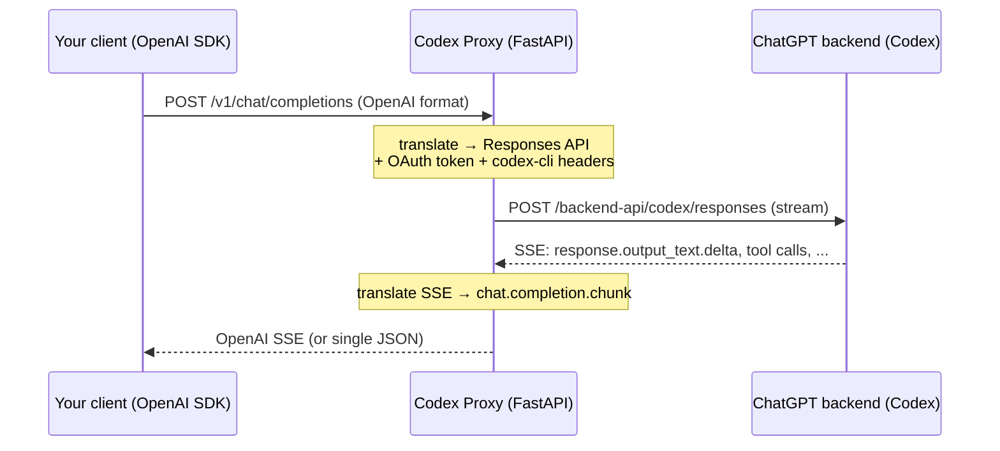

<div align="center">

# 🧩 Codex Proxy

**Use your ChatGPT login as if it were the OpenAI API.**

A local proxy that speaks the OpenAI protocol (`/v1/chat/completions`) and forwards everything to the **Codex** backend — authenticating with your **ChatGPT** account, with no paid API key for chat.


</div>

---

## ✨ Features

- 🔓 **ChatGPT login** (OAuth PKCE) — no API key needed for chat.
- 🤖 **Frontier models** — `gpt-5.5`, `gpt-5.4`, `gpt-5.4-mini`, and more.
- 🌊 **SSE streaming**, **tool calling**, and **reasoning** (`reasoning_content`).
- 📚 **Automatic interactive docs** at **`/docs`** (Swagger, with an Authorize button).
- 🐳 **Docker-first** — tokens live in a volume, no hardcoded host path.
- 🔁 **Auto token refresh** with transparent re-login.
- 🔌 **OpenAI drop-in** — works with any OpenAI SDK or client.

## 🚀 Quick start (Docker)

```bash
docker compose up
```

1. On **first run**, the container prints a **login URL** to the logs.
2. Open that URL in your host browser and sign in to ChatGPT.
3. Done — tokens are saved to the `codex-data` volume and refresh automatically. 🎉

> The login callback returns to `http://localhost:1455` (published by Compose). Subsequent starts require no login.

### Or run the prebuilt image (GHCR)

No build needed — pull the published image:

```bash
docker run -d --name codex-proxy -p 5001:5001 -p 1455:1455 \
  -v codex-data:/app/data ghcr.io/opastorello/codex-proxy:latest
docker logs -f codex-proxy   # grab the login URL on first run
```

<details>
<summary>Run locally, without Docker</summary>

```bash
pip install -r requirements.txt
uvicorn app:app --host 0.0.0.0 --port 5001
```
</details>

## 👤 Signing in with your ChatGPT account

The proxy reaches the Codex backend using **your ChatGPT login** — the same account that powers the Codex CLI. It's an OAuth flow (browser sign-in); there is **no username/password API**, because OpenAI only allows browser-based sign-in.

**First run:** with no saved token, the proxy prints a login URL to the logs:

```
================================================================
  LOGIN REQUIRED — open this URL in your browser:

    https://auth.openai.com/oauth/authorize?...
================================================================
```

Open it, sign in to ChatGPT, and the callback returns to `http://localhost:1455`. The token is saved (the `codex-data` volume in Docker, or `tokens.json` locally) and **auto-refreshes** — you won't sign in again.

Check whether the proxy is signed in at any time:

```bash
curl http://localhost:5001/auth/status
# {"authenticated": true, "account_id": "...", "plan": "plus", "expires_in_seconds": 863900}
```

> **Why two ports?** `5001` is the API you actually call; `1455` is used **only** during login to catch the OAuth redirect (`http://localhost:1455/auth/callback`). After signing in it just sits idle.

> Requires a ChatGPT **Plus / Pro / Team** subscription (Codex access). There is no API-key path for chat — reusing your ChatGPT login is the whole point of this proxy.

### Headless / no browser on the server

The login needs a browser *once*, but not necessarily on the server:

- **Use a browser elsewhere** — the redirect target is `http://localhost:1455`; as long as that port reaches the container, you can finish the login from any browser that can open the URL.
- **Reuse an existing Codex CLI login** — if you've run `codex login`, copy the `access_token` / `refresh_token` / `id_token` values from `~/.codex/auth.json` into the proxy's token file (the `codex-data` volume, or `tokens.json`). Same OAuth client, so they work as-is.

## 🔌 Using it with OpenAI clients

Point any OpenAI client at the proxy:

```env
OPENAI_BASE_URL=http://localhost:5001/v1
OPENAI_API_KEY=any-value          # or your PROXY_API_KEY, if you set one
```

**curl:**

```bash
curl http://localhost:5001/v1/chat/completions \
  -H "Content-Type: application/json" \
  -d '{"model":"gpt-5.4-mini","messages":[{"role":"user","content":"Hello!"}]}'
```

**Python (official `openai` SDK):**

```python
from openai import OpenAI

client = OpenAI(base_url="http://localhost:5001/v1", api_key="any-value")

resp = client.chat.completions.create(
    model="gpt-5.4-mini",
    messages=[{"role": "user", "content": "Explain recursion in one sentence."}],
)
print(resp.choices[0].message.content)
```

**Streaming:**

```python
stream = client.chat.completions.create(
    model="gpt-5.4-mini",
    messages=[{"role": "user", "content": "Count from 1 to 5."}],
    stream=True,
)
for chunk in stream:
    print(chunk.choices[0].delta.content or "", end="", flush=True)
```

💡 Open **http://localhost:5001/docs** to try everything from the browser.

## 🔑 Authentication

Two independent layers:

1. **Proxy → ChatGPT backend** — handled automatically by the OAuth login on first run. You never pass a key for this.
2. **Client → Proxy (optional)** — **off by default**: while `PROXY_API_KEY` is unset, the proxy accepts every request. Set it to require a key:

   ```env
   PROXY_API_KEY=my-secret-key
   ```

   Then every request must include it:

   ```bash
   curl http://localhost:5001/v1/chat/completions \
     -H "Authorization: Bearer my-secret-key" \
     -H "Content-Type: application/json" \
     -d '{"model":"gpt-5.4-mini","messages":[{"role":"user","content":"Hi"}]}'
   ```

   In **`/docs`**, click **Authorize** 🔓 and paste the key to call the endpoints from the browser.

## 🧠 How it works



## 🧩 Endpoints

| Method | Route | Description |
|--------|-------|-------------|
| `POST` | `/v1/chat/completions` | Chat — streaming/non-streaming, tool calling, reasoning |
| `GET`  | `/v1/models` | Model list |
| `GET`  | `/health` | Health check |
| `GET`  | `/auth/status` | Whether the proxy is signed in (account, plan, token expiry) |
| `GET`  | `/docs` · `/openapi.json` | Interactive documentation |

## ⚙️ Environment variables

See [`.env.example`](.env.example). Main ones:

| Variable | Default | Description |
|----------|---------|-------------|
| `CODEX_MODEL` | `gpt-5.4-mini` | Model used when the request omits `model` |
| `CODEX_MODELS` | _(built-in list)_ | Comma-separated models shown by `/v1/models` (cosmetic; override to track model updates) |
| `PROXY_PORT` | `5001` | Host port (the container always listens on 5001) |
| `PROXY_API_KEY` | _(empty)_ | If set, requires `Authorization: Bearer <key>` |
| `CODEX_REASONING_EFFORT` / `CODEX_REASONING_SUMMARY` | `medium` / `auto` | Default reasoning |
| `BACKEND_TIMEOUT` | `600` | Backend timeout (s) |
| `TOKEN_FILE` | `tokens.json` | Token file path (in Docker: `/app/data/tokens.json`) |
| `PROXY_DEBUG_EVENTS` | `0` | Log every backend SSE event |

## ⚠️ Known limitations

- **Chat only — no embeddings.** The Codex backend has no embeddings endpoint, and a ChatGPT subscription doesn't include OpenAI API quota. Use a local embedding model for RAG.
- `temperature`, `top_p`, and `max_tokens` are **ignored** (the Codex backend may reject them).

## 🔐 Security

- `tokens.json` holds **live OAuth tokens** — it's already in `.gitignore`; **never** commit it.
- Only expose the proxy publicly with `PROXY_API_KEY` set.

## 🗂️ Project layout

```text
.
├── app.py              # FastAPI server — all logic lives here
├── requirements.txt    # fastapi + uvicorn
├── Dockerfile
├── docker-compose.yml  # codex-data volume for tokens
├── .env.example
└── README.md
```

## 🛠️ Troubleshooting

| Symptom | Likely cause / fix |
|---------|--------------------|
| No login URL shown | Check the logs (`docker compose logs -f`); login runs at startup |
| Callback never completes | Make sure port **1455** is published and free on the host |
| `401 Invalid proxy API key` | Send `Authorization: Bearer <PROXY_API_KEY>` |
| Asks for login every time | `tokens.json` / the volume isn't persisting across restarts |

## 📄 License

[MIT](LICENSE) © [Nicolas Pastorello](https://github.com/opastorello) (**@opastorello**)
